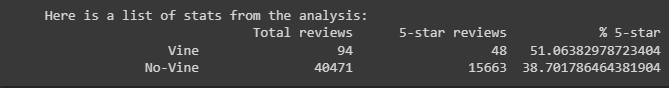
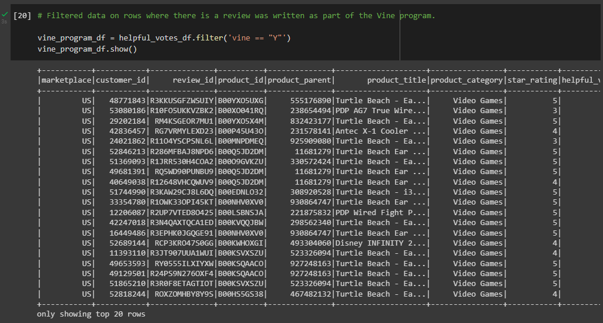
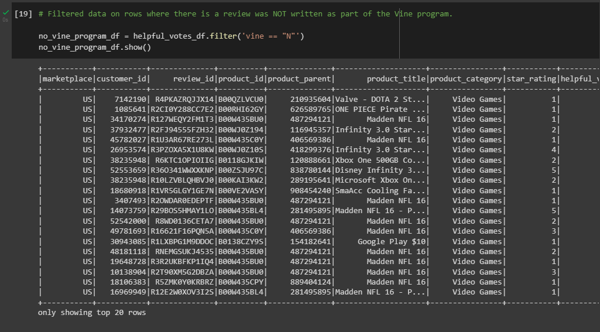

# Module 16 Challenge
## Deliverable 3

### Overview of the analysis
The purpose of this analysis was to analyze Amazon reviews written by members of the paid Amazon Vine program, which is a service that allows manufacturers and publishers to receive reviews for their products. We wanted to determine if there is any bias toward favorable reviews from Vine members in our dataset.

### Results

Here is an image summarizing the stats from my analysis:

1. _"How many Vine reviews and non-Vine reviews were there?"_ 

There were 94 Vine reviews and 40,471 non-Vine reviews in total.

2. _"How many Vine reviews were 5 stars? How many non-Vine reviews were 5 stars?"_

There were 48 five-star Vine reviews and there were 15,663 non-Vine five-star reviews.
  
3. _"What percentage of Vine reviews were 5 stars? What percentage of non-Vine reviews were 5 stars?"_

51.06% of Vine reviews were five stars, while 38.70% of non-Vine reviews were five stars.

### Summary
To summarize, it does seem that there is positivity bias for reviews in the Vine program. According to the stats, 51% of reviews in the Vine program were five-star ratings as opposed to 38.7% from the non-Vine reviews.  There were significantly fewer total reviews in the Vine program compared to reviews not in the Vine program.

One additional analysis that I could perform with the dataset is to find the average rating of the Vine reviews and the average rating of the non-Vine reviews. Measuring the average review rating could further support my claim that there is positivity bias for reviews in the Vine program. 
